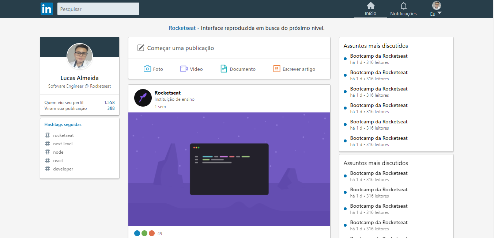

# :page_with_curl: Table of Contents

* [About](#information_source-about)
* [Technologies](#computer-technologies)
* [How to run](#seedling-how-to-run)
* [License](#pencil-license)

# :information_source: About

This project is a UI clone of the LinkedIn main page, developed with ReactJS, appying the shimmer effect.

## Desktop interface



## Mobile interface


# :computer: Technologies

  - ReactJS
  - Typescript
  - Styled Components

# :seedling: How to run

```bash
# Clone Repository
$ git clone https://github.com/lucas-almeida-silva/ui-clone-linkedin.git

# Go to project folder
$ cd ui-clone-linkedin

# Install Dependencies
$ npm install or yarn install

# Run Aplication
$ npm start or yarn start
```
Access the application at http://localhost:3000/

# :pencil: License

This project is under the [MIT license](LICENSE).